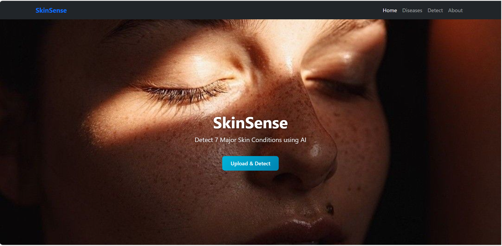

# SkinSense – Skin Disease Detection Using Machine Learning

## Project Overview

SkinSense is a machine learning-based skin disease detection web application developed using Python, Django, TensorFlow, Keras, and Convolutional Neural Network (CNN).

The system is designed to assist users in identifying common skin diseases by uploading skin images and receiving an instant prediction through a web-based interface. The model is trained using the HAM10000 dataset to classify different categories of skin lesions.

## Features

* User-Friendly Web Interface
* Skin Image Upload
* Skin Disease Prediction
* CNN-Based Image Classification
* HAM10000 Dataset Integration
* Image Preprocessing
* Machine Learning Model Integration
* Instant Prediction Results
* Disease Classification
* Responsive Web Interface
* Prediction Result Display

## Technologies Used

### Frontend

* HTML
* CSS
* Bootstrap
* JavaScript

### Backend

* Python
* Django

### Machine Learning

* TensorFlow
* Keras
* Convolutional Neural Network (CNN)
* Image Classification

### Dataset

* HAM10000 Dataset

### Tools and Platforms

* GitHub
* VS Code
* Jupyter Notebook
* Google Colab

## System Architecture

The SkinSense system follows a layered architecture consisting of:

* User Layer
* Frontend Layer
* Django Application Layer
* Image Processing Layer
* Machine Learning Layer
* Prediction Layer

The user uploads a skin image through the web interface. Django handles the request and processes the uploaded image. The image is preprocessed and passed to the trained CNN model. The model analyzes the image and predicts the corresponding skin disease category. The prediction result is then displayed to the user through the web interface.

## Working of the System

1. The user accesses the SkinSense web application.
2. The user uploads a skin lesion image.
3. Django receives and processes the uploaded image.
4. The image is resized and preprocessed according to the model requirements.
5. The processed image is passed to the trained CNN model.
6. The CNN model analyzes the image features.
7. The model predicts the skin disease category.
8. The prediction result is generated.
9. The predicted disease is displayed to the user through the web interface.

## Machine Learning Model

SkinSense uses a Convolutional Neural Network (CNN) for skin disease image classification.

The CNN model learns important visual features from skin lesion images and uses these features to classify the input image into the appropriate disease category.

The model was trained using the HAM10000 dataset, which contains a large collection of dermatoscopic images representing different types of skin lesions.

The machine learning workflow consists of:

* Image Collection
* Data Preprocessing
* Image Resizing
* Data Augmentation
* CNN Model Training
* Model Validation
* Model Evaluation
* Prediction

## Why These Technologies Were Used

* **Python** was used for machine learning development and application logic.
* **Django** was used to develop the web application and integrate the machine learning model.
* **TensorFlow** was used for building and training the deep learning model.
* **Keras** was used to simplify CNN model development and training.
* **CNN** was selected because it is well suited for image classification and feature extraction.
* **HAM10000** was used as the dataset for training the skin disease classification model.
* **HTML and CSS** were used to create the web interface.
* **Bootstrap** was used to create a responsive and user-friendly interface.

## Applications

SkinSense can be used for:

* Skin Disease Classification
* Preliminary Skin Lesion Analysis
* Medical Image Classification
* Healthcare Assistance
* Educational Applications
* Machine Learning-Based Healthcare Research

> **Note:** SkinSense is intended as an academic and research project and should not be considered a substitute for professional medical diagnosis.

## Future Scope

* Improve model accuracy with larger and more diverse datasets
* Add more skin disease categories
* Implement transfer learning using advanced CNN architectures
* Develop a mobile application
* Add prediction confidence scores
* Integrate explainable AI techniques
* Deploy the system on a cloud platform
* Improve image preprocessing and augmentation
* Integrate the system with healthcare platforms
* Develop real-time skin image analysis

# Screenshots

## Home Page

## Image Upload Page

## Prediction Page

## Disease Prediction Result

## System Architecture

## Workflow

## Developed By

**Misriya A A**
MCA Student
Ilahia College of Engineering and Technology

**Project:** SkinSense – Skin Disease Detection Using Machine Learning
